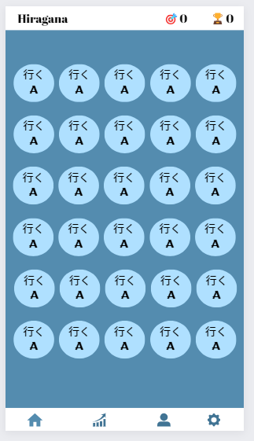
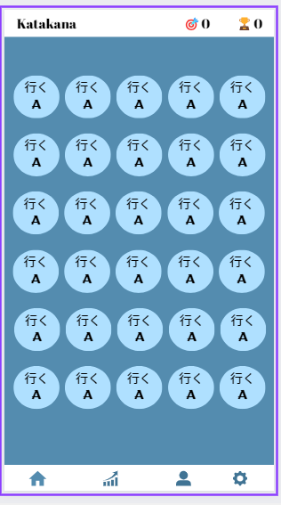

# Japaprende
## Sistema Mobile de Aprendizagem rápida de Consulta de dicionário da lingua Japonesa
 

## Descrição:  
É um sistema íntegro, com ferramentas simples e objetivas de cunho educacional e aprendizagem em Linguas e Letras.  
Nesse caso: O Japonês Moderno

 

Constituido de Uma tela Principal, Telas de Login, Cadastro e Uma tela para desenvolvimento da linguagem determinada

 

Usando o Primero Alfabeto-Composto do Japonês, o Hiragana que é utilizado para escrever palavras de origem japonesa e, principalmente, para escrever partículas de ligação e complementos de tempos verbais do KANJI que expresse ação.

 

Já o Katakana é para escrever palavras de origem estrangeira, assim como nomes próprios estrangeiros

## Para ultilizar esta aplicação você deverá possuir:

- "Android Studio Girafe" - Ultima versão Disponivel
- Ou baixe algum aplicativo que possa ler o QRcode do Japaprende
- Ouu aguarde no Play Store / Apple Store 😎

### Nossas redes sociais para acompanhar novos projetos:  
  <a href="https://www.linkedin.com/in/iann-oliveira-3106b11a4/" target="_blank">Iann Oliveira | RA: 1719175</a>
    <a href="https://www.linkedin.com/in/matheus-scola/" target="_blank">Matheus Scola | RA: 1715722</a>
      <a href="https://www.linkedin.com/in/leticia904/" target="_blank">Leticia Almeida | RA: 1656484</a>
        <a href="https://www.linkedin.com/in/gabriel-ferreira-da-silva-396900212/?utm_source=share&utm_campaign=share_via&utm_content=profile&utm_medium=android_app" target="_blank">Gabriel Ferreira | RA: 1689505</a>
          <a href="https://www.linkedin.com/in/brenda-freitas-5b899b230/?utm_source=share&utm_campaign=share_via&utm_content=profile&utm_medium=android_app" target="_blank">Brenda Freitas | RA: 1804731</a>
            <a href="https://www.linkedin.com/in/albert-amorim-3645251a7/?originalSubdomain=br" target="_blank">Albert Amorim | RA: 1797880</a>

